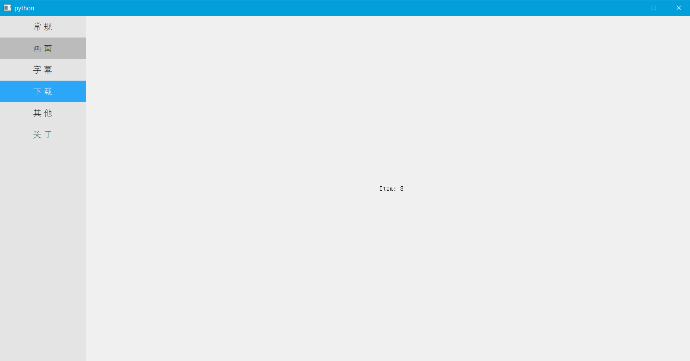

# Navigation Widget Python implementation 

This is an inheritance of `PyQt5.QtWidgets.QWidget` used as a navigation tool bar at left side of MainWindow.

## Call

```python
from QNavigationWidget import QNavigationWidget

navigationWidget = QNavigationWidget()
```


## Add Item into navigation bar

```python
navigationWidget.addItem("Item Name")
```


## Set height of row

```python
navigationWidget.setRowHeight(int)
```


## Connection of signal of changing selected item

```python
navigationWidget.signal.connect(SLOT_FUNC)
```


## Set according to your preference

```python
class QNavigationWidget(QtWidgets.QWidget):
    def __init__(self, parent=None):
        ...
        self.backgroundColor = '#E4E4E4'
        self.selectedColor = "#2CA7F8"
        self.hoveredColor = "#BBBBBB"
        ...
```


## An example


