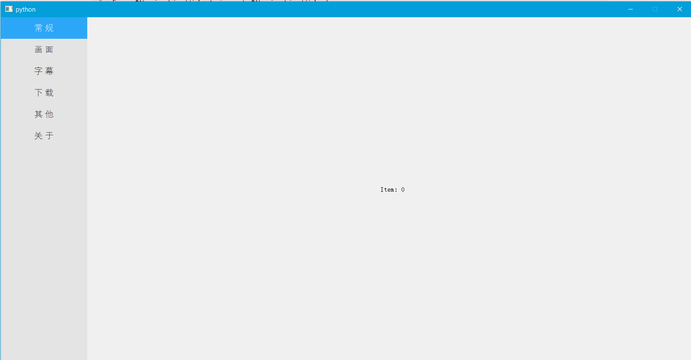
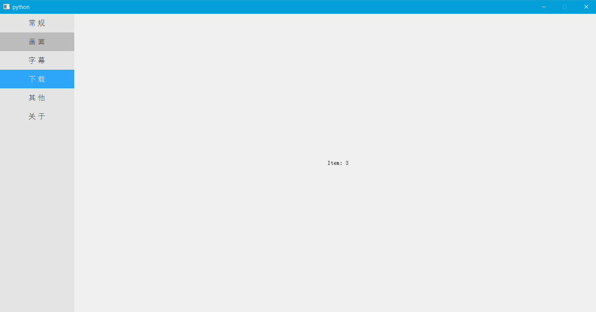

# 一个Python（PyQt5）版本的导航栏

这是继承 `PyQt5.QtWidgets.QWidget` 的一个子类，你可以像调用普通`Widget`一样调用它。写的比较简单，可以根据自己喜好更改。

## 调用

```python
from QNavigationWidget import QNavigationWidget

navigationWidget = QNavigationWidget()
```


## 添加条目

```python
navigationWidget.addItem("Item Name")
```


## 设置行高

```python
navigationWidget.setRowHeight(int)
```


## 信号连接到槽函数

```python
navigationWidget.signal.connect(SLOT_FUNC)
```


## 根据个人喜好设置

```python
class QNavigationWidget(QtWidgets.QWidget):
    def __init__(self, parent=None):
        ...
        self.backgroundColor = '#E4E4E4'
        self.selectedColor = "#2CA7F8"
        self.hoveredColor = "#BBBBBB"
        ...
```


## 一个例子



